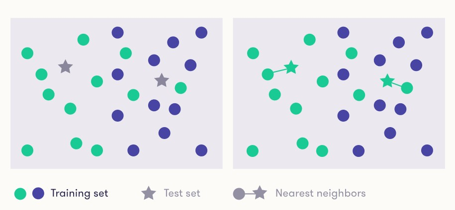
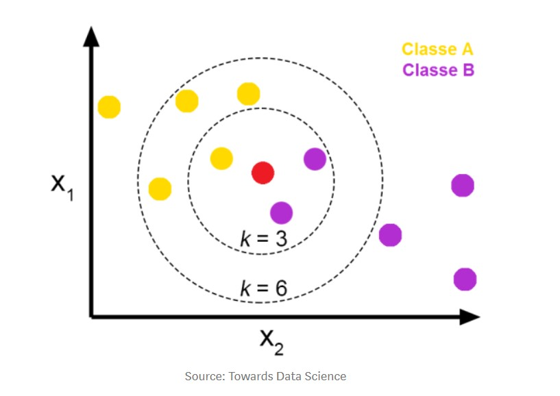

# KNN (K-nearest Neighbors Algorithm)

The KNN classifier is among the simplest possible classifiers.
When given an item to classify, it finds the training data item that is most similar to the new item, and outputs its label.

The two test items are both classified in the "green" class because theirs nearest neighbors are both green.

*Nearest neighbor classifier is the definition of distance or similarity between instances*

## reader_etl.py
Here is shown how to extract, transform and load (ETL) data from an file.

## knn_iris.py
Here is shown the difference between metrics:
 - Manhattan Distance - Calculate the distance between real vectors using the sum of their absolute difference.
 - Euclidean Distance - Calculate the distance between real vectors using the sum of the squares of the differences between corresponding values.
 - k_scoring is to determine which of the K instances in the training data set are most similar to a new input.
 
