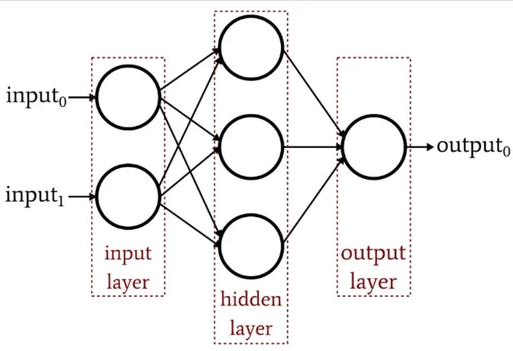

# Multi Layer Perceptron (MLP)

The MLP consists of an input layer and an output layer which are fully connected. MLPs have the
same input and output layers but may have multiple hidden layers in between the aforementioned layers.

